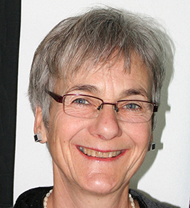

# Über mich

Ich wurde am 18. Dezember 1949 geboren, bin in Zürich aufgewachsen und seit 1980 wohnhaft im Toggenburg in der Ostschweiz. Auf meine Erstausbildung zur Floristin folgte eine Ausbildung als Aktivierungstherapeutin. Ich bin Mutter von drei erwachsenen Kindern und zudem eine leidenschaftliche Gärtnerin und Köchin.
{: .fs-6 .fw-300 }

## Quilten und Patchworken: der Anfang

Meine Initialzündung für das Quilten im Jahr 2000 war die unkonventionelle Farb- und Formgestaltung der Quilts der damals 80jährigen Berti Feissli aus Lichtensteig.
Ich erkannte, dass das Quilten nicht an traditionelle Muster gebunden und freies Gestalten möglich ist.
Seither arbeite ich frei mit selbstgefärbten Stoffen, Stoffdruck usw.

## Kurse und Techniken

Nancy Crow (Ohio, USA) hat meine Arbeiten stark geprägt. Bis jetzt habe ich insgesamt fünf Workshops von Nancy in Falera (Schweiz) besucht.

Ausserdem eignete ich mir systematisch dem Quilten und Patchworken verwandte Techniken zum Gebrauch in den eigenen Werken an – unter anderem: Stoff- und Siebdruck (Cécile Trentini), Shibori (Heidi Hunninghaus), Stofffärben (Heide Stoll-Weber), verschiedene Nähtechniken (Judith Mundwiler) und Sticken und Quilten (Elsbeth Nusser-Lampe).
