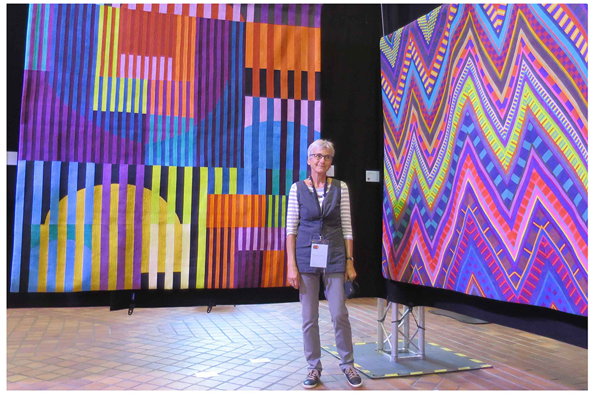
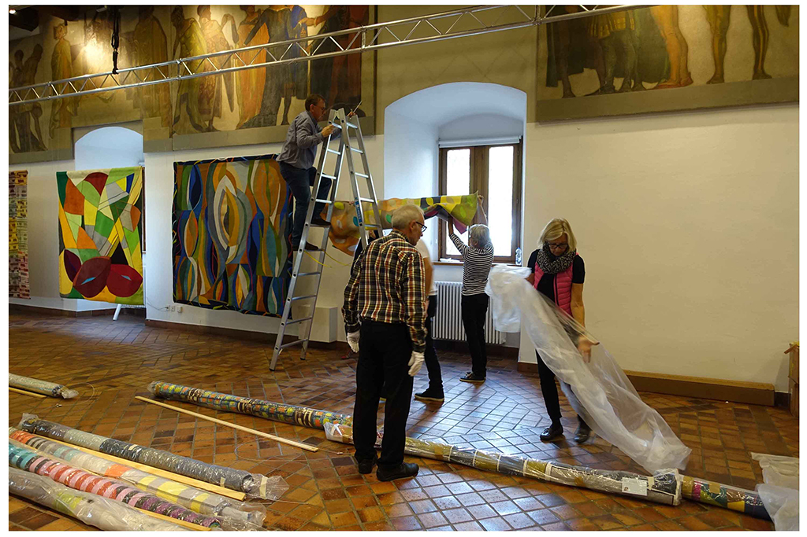
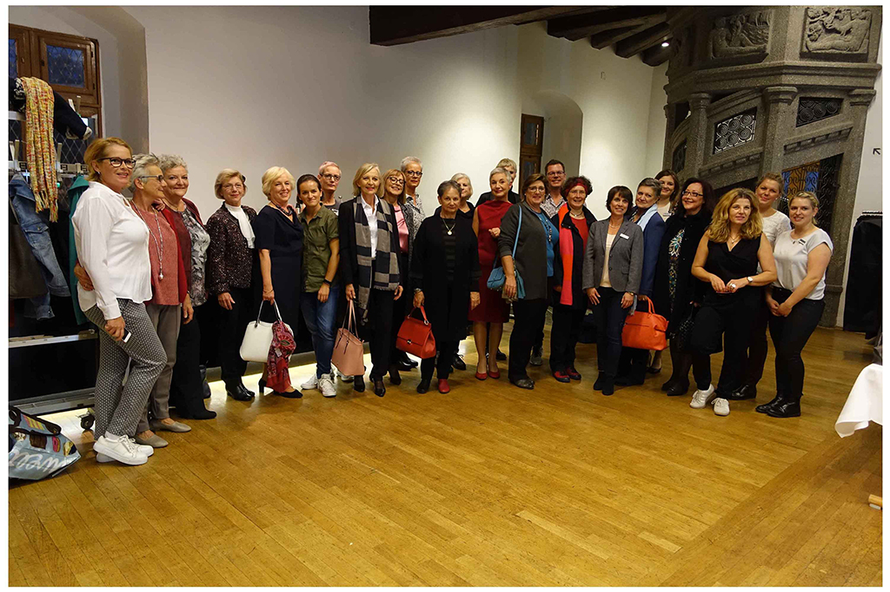

# Color Improvisations 2 in Konstanz

Die Ausstellung Color Improvisations 2 im Konzilgebäude Konstanz fand vom 12.–17. Oktober 2017 statt. Die internationale Ausstellung präsentierte 50 farbenfrohe, grossflächige Quilts aus aller Welt von Künstlerinnen, die Kurse der renommierten Quilterin Nancy Crow besuchten. Eröffnet wurde die Ausstellung auf unkonventionelle Art und Weise: mit einer Modenschau von Peter Hahn – präsentiert von den Künstlerinnen.
{: .fs-6 .fw-300 }

