[comment]: <> (
---
title: Werke 2011-2014
parent: Galerie
has_children: false
nav_order: 3
---
)

# Werke 2011-2014

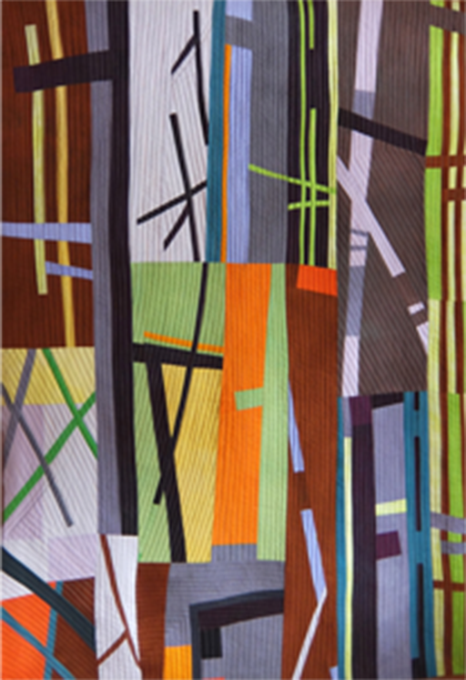

Ohne Titel

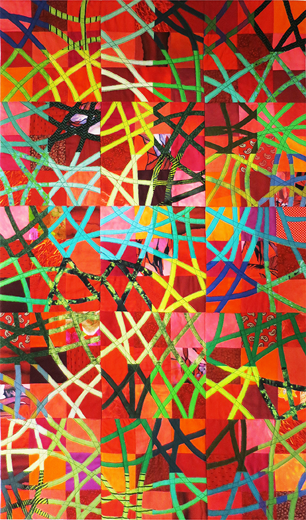

Ohne Titel

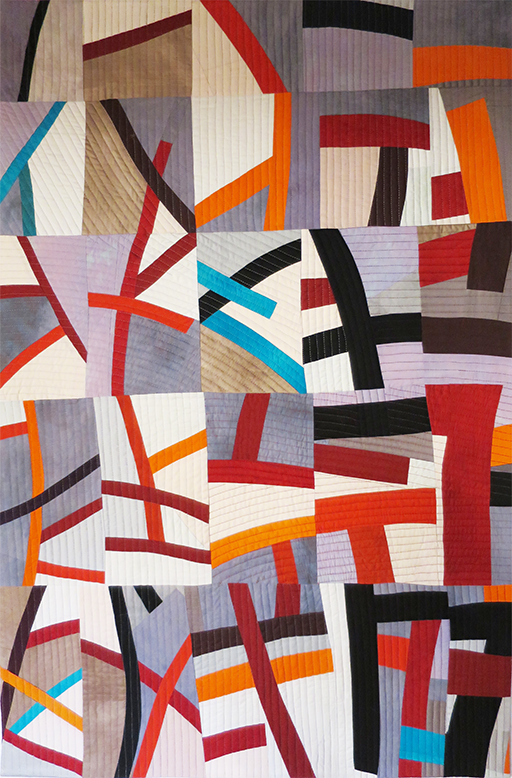

Ohne Titel

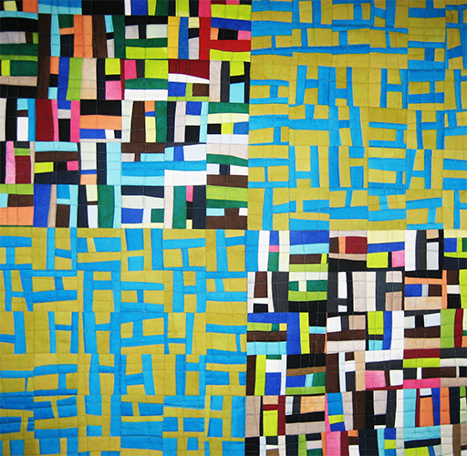

Tanz der H 67 x 67 cm

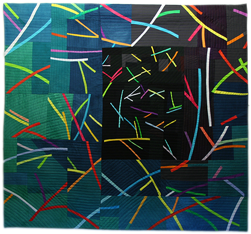

Farbfunken 117 x 103 cm

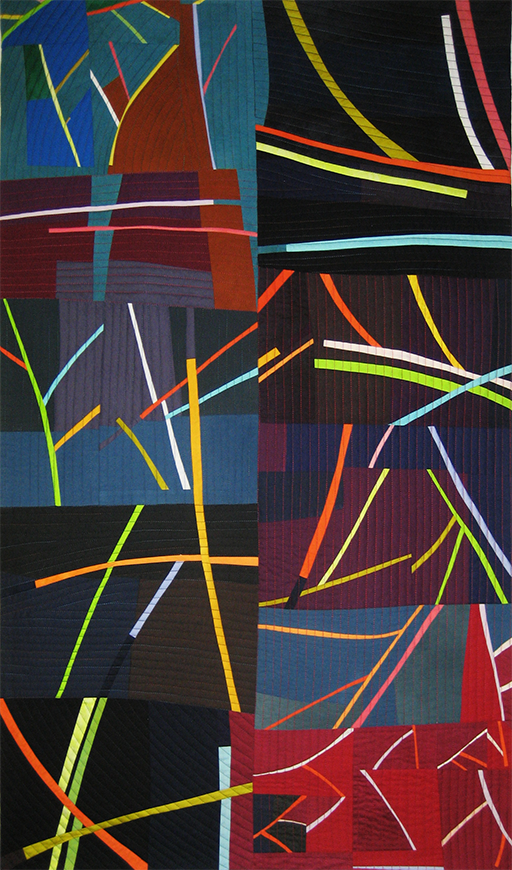

Jazz 79 x 136 cm

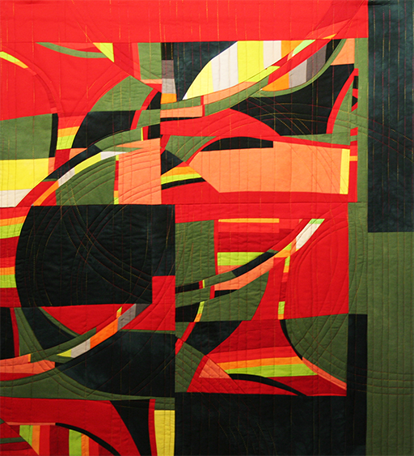

Remolino 80 x 87 cm

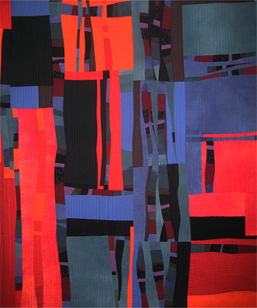

Feuer und Eis 115 x 180 cm

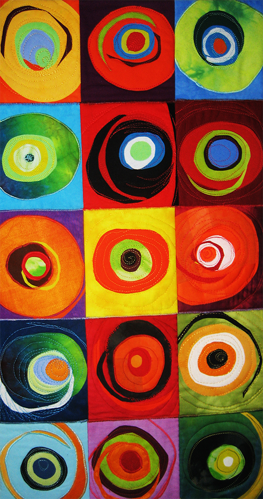

Lollipop 36 x 67 cm

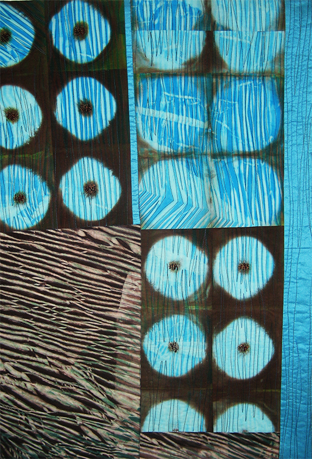

Shibori I 57 x 80 cm

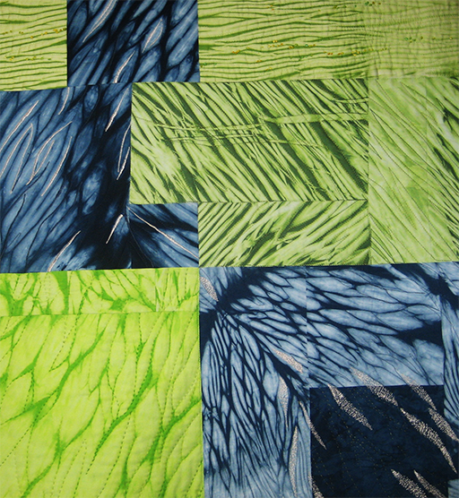

Shibori II 95 x 85 cm

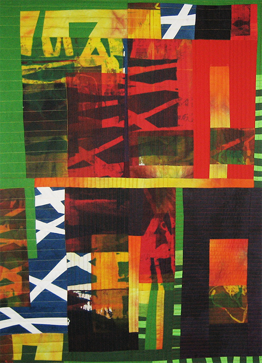

Siebdruckstudie 82 x 115 cm

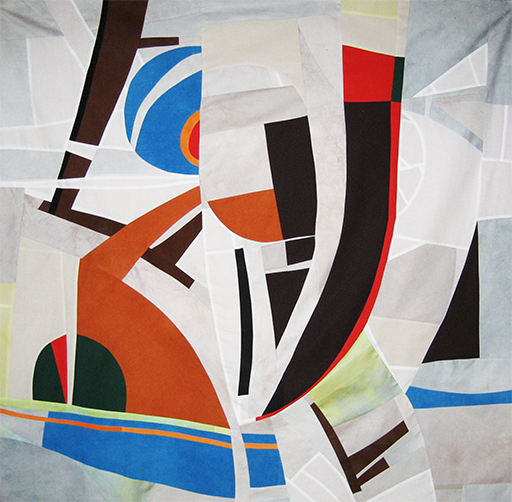

Genesis 112 110 cm

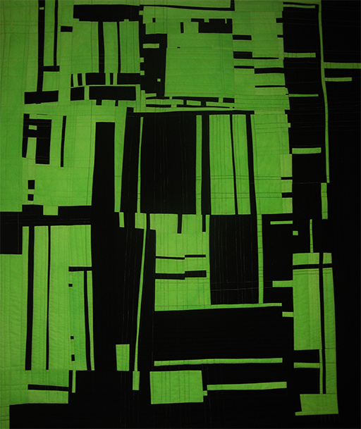

Schwarz-Grün 110 x 125 cm

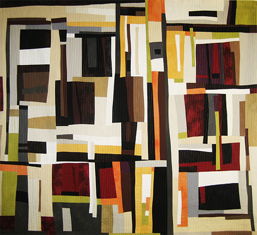

Savannah 168 x 154 cm

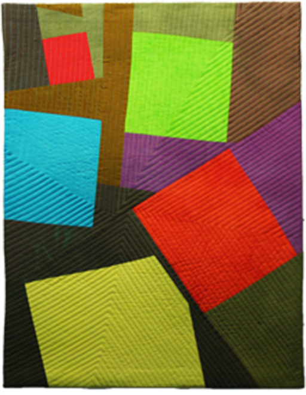

Dull Glowing 1

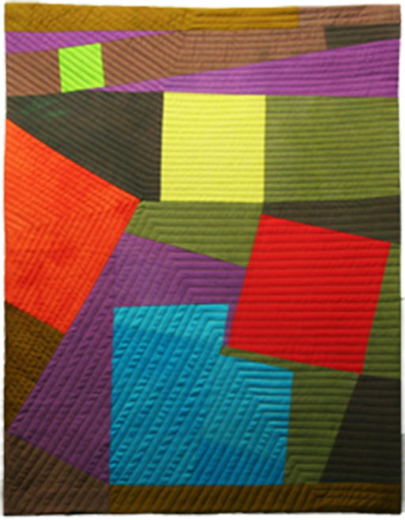

Dull Glowing 2

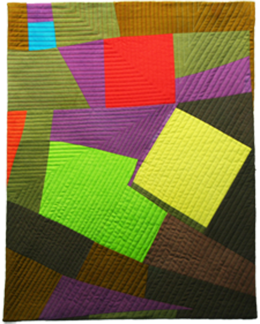

Dull Glowing 3

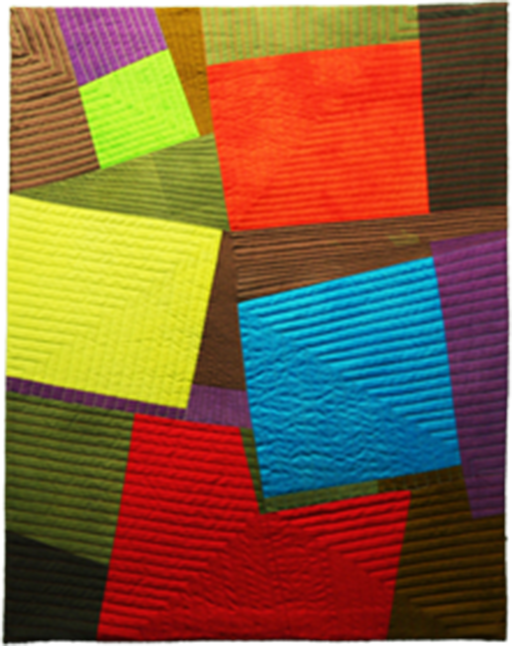

Dull Glowing 4

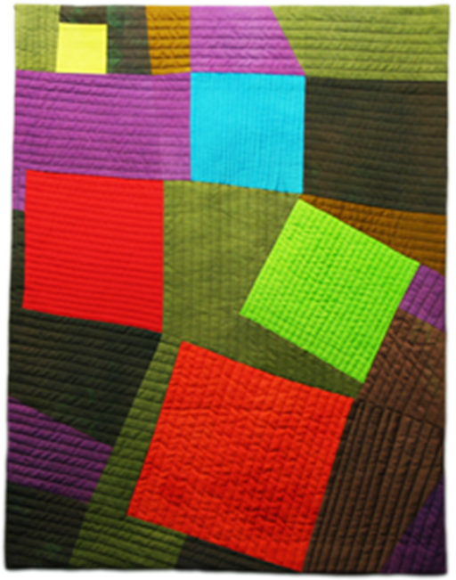

Dull Glowing 5